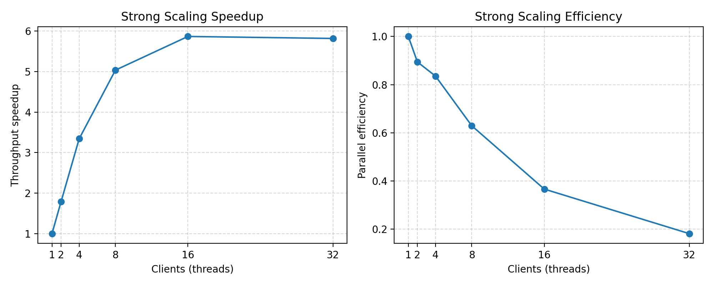
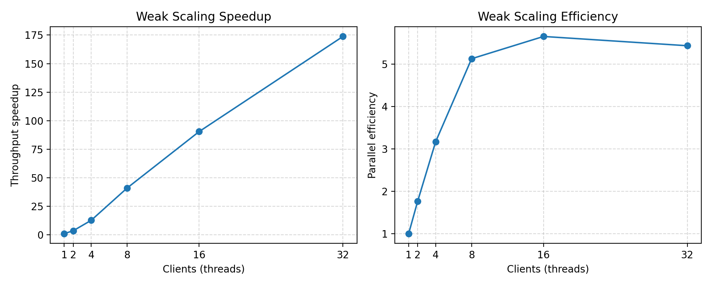

# Teaclave Java Benchmark

Benchmark suite for the Apache Teaclave Java SDK showcasing a differentially private binary aggregation tree that runs inside an enclave and is driven by a host-side harness. The code base follows the standard three-module layout (`common`, `enclave`, `host`) so it can be built with Maven out of the box or executed inside the provided development container.

## Project Layout

- `common/` – Enclave service contracts and shared DTOs annotated with `@EnclaveService`.
- `enclave/` – Implementation of the aggregation tree plus the service exposed to the host. State is kept inside the enclave and updated via `initBinaryAggregation`, `addToBinaryAggregation`, and `getBinaryAggregationSum`.
- `host/` – Benchmark runner that prepares a fixed workload, executes weak/strong scaling passes, and prints JSON metrics suitable for plotting.

## Benchmark Approach

The enclave adapts the original `BinaryAggregationTreeBase` algorithm to use primitive arrays and enclave-friendly state management. Hosts initialise the tree for a chosen capacity (for example `n = 10_000`, `sigma > 0`) and then stream values one by one; the enclave keeps track of the private sum as Gaussian noise is injected per node.

The host benchmark proceeds in three steps:

1. **Baseline measurement** – Use the configured dataset size (`TEACLAVE_BENCH_DATA_SIZE`) and the minimum requested thread count to derive the per-thread workload, running a short warm-up before the timed passes.
2. **Weak scaling** – Increase the number of worker threads while keeping the per-thread workload fixed to observe aggregate growth.
3. **Strong scaling** – Increase the number of worker threads while keeping the total workload fixed to observe how latency shrinks.

## Results

- CPU: Intel(R) Xeon(R) Gold 5315Y @ 3.20 GHz
- SGX2 enclave (TEE SDK execution mode)

The benchmark used a 1024-element workload at 0.5 ms per batch before
running the weak and strong scaling passes. All metrics below stem from `data/benchmark_results.json`;
plots are generated with `scripts/generate_plots.py`.

### Strong scaling

Throughput climbs from ~9 kops/s with a single client to roughly 40 kops/s at eight clients, then only inches up (~41 kops/s) at sixteen threads before sliding back to ~35 kops/s at 32 clients. SGX scheduling keeps the enclave from exploiting additional parallelism once we exceed the 8-16 client band.


The speedup curve peaks at ~4.5x with 16 clients (~28% efficiency) and drops afterwards; efficiency already halves beyond eight clients as context switches dominate the oversubscribed enclave.



### Weak scaling

Under weak scaling, throughput tracks the client count up to 16 threads: it rises from ~6.6 kops/s with one client to a little over 52 kops/s, then levels off around 51 kops/s once 32 clients arrive and the enclave saturates.


Scaled speedup tops out near 7.9x at 16 clients. Efficiency remains near 1.0 through eight clients (with a small super-linear blip at two) before tailing off to ~0.24 at 32 clients as larger batches run into the same scheduling limit.



### Reproducing the figures

```
python3 -m venv .venv
source .venv/bin/activate
pip3 install --upgrade pip matplotlib numpy
python3 scripts/generate_plots.py
```

## Getting Started

You can work either from the host OS or inside the preconfigured devcontainer.

### Option 1: Devcontainer (recommended)

1. Ensure Docker and the VS Code Dev Containers extension (or `devcontainer` CLI) are installed.
2. Run `task devcontainer` **or** open the folder in VS Code and “Reopen in Container”.
3. The tooling (JDK, Maven, Teaclave SDK) is provisioned automatically inside the container.

The available `go-task` shortcuts are listed with `task -l`. Key entries:

| Task | Description |
|------|-------------|
| `task devcontainer` | Build, start, and attach to the devcontainer (wrapper around the tasks below). |
| `task devcontainer-build` | Build the devcontainer image. |
| `task devcontainer-up` | Start or reuse the devcontainer without attaching. |
| `task devcontainer-attach` | Exec into the running devcontainer shell. |
| `task devcontainer-down` | Stop and remove the container and volumes. |
| `task devcontainer-recreate` | Rebuild the container from scratch for a clean environment. |

### Option 2: Local toolchain

Install JDK 11+ and Maven 3.6+ on your machine, then clone the repository and continue with the build instructions below.

## Building

From the repo root:

```bash
cd teaclave && mvn clean package -DskipTests -Pnative
```

To run tests (mock enclave only):

```bash
cd teaclave && mvn -pl host test
```

## Running Benchmarks

After packaging, launch the host benchmark with both shaded JARs on the classpath:

```bash
java \
  -cp host/target/host-1.0-SNAPSHOT-jar-with-dependencies.jar:enclave/target/enclave-1.0-SNAPSHOT-jar-with-dependencies.jar \
  com.benchmark.teaclave.host.Main
```

Set environment variables to tweak the workload. The most relevant knobs are:

| Variable | Default | Notes |
|----------|---------|-------|
| `TEACLAVE_BENCH_ENCLAVE_TYPE` | `MOCK_IN_JVM` | Use `TEE_SDK` to point at hardware once available. |
| `TEACLAVE_BENCH_SIGMA` | `0.5` | Gaussian noise std-dev. |
| `TEACLAVE_BENCH_WEAK_SCALES` | `1,2,4,8,16,32` | Comma-separated thread counts used for weak scaling (per-thread workload fixed). |
| `TEACLAVE_BENCH_STRONG_SCALES` | `1,2,4,8,16,32` | Comma-separated thread counts used for strong scaling (total workload fixed). |
| `TEACLAVE_BENCH_DATA_SIZE` | `1024` | Number of values processed during the baseline and strong-scaling passes. |
| `TEACLAVE_BENCH_WARMUP` | `3` | Warm-up iterations run before each timed pass. |
| `TEACLAVE_BENCH_MEASURE` | `5` | Timed iterations per pass. |
| `TEACLAVE_BENCH_NATIVE_PARALLELISM` | `32` | Max concurrent enclave calls when running on TEE hardware (ignored in MOCK mode). |

Tweak the entries in `.env` to change the run parameters. When targeting real SGX hardware (`TEE_SDK`), the benchmark throttles the number of concurrent enclave calls to `TEACLAVE_BENCH_NATIVE_PARALLELISM` to avoid exhausting TCS slots (it would crash the engine otherwise :) ).

Otherwise, you can simply set environment variables inline as shown in the example below (force a 10 000-element workload on the TEE SDK):

```bash
TEACLAVE_BENCH_ENCLAVE_TYPE=TEE_SDK \
TEACLAVE_BENCH_SIGMA=0.6 \
TEACLAVE_BENCH_DATA_SIZE=10000 \
TEACLAVE_BENCH_WARMUP=2 \
TEACLAVE_BENCH_MEASURE=5 \
java -cp ... com.benchmark.teaclave.host.Main
```

## Collecting Metrics

Redirect stdout to capture the workload/weak/strong metrics for plotting:

```bash
java -cp ... com.benchmark.teaclave.host.Main > benchmark-results.json
```
