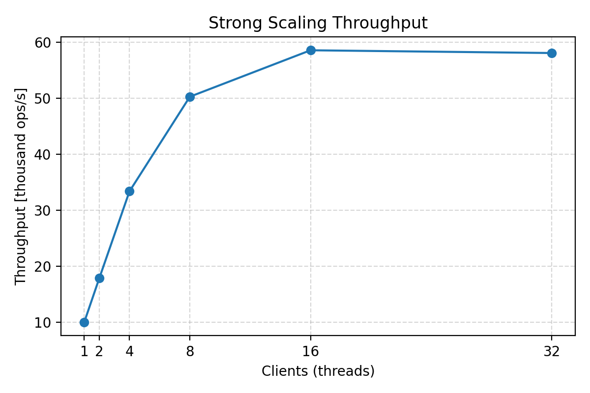

# Teaclave Java Benchmark

Benchmark suite for the Apache Teaclave Java SDK showcasing a differentially private binary aggregation tree that runs inside an enclave and is driven by a host-side harness. The code base follows the standard three-module layout (`common`, `enclave`, `host`) so it can be built with Maven out of the box or executed inside the provided development container.

## Project Layout

- `common/` – Enclave service contracts and shared DTOs annotated with `@EnclaveService`.
- `enclave/` – Implementation of the aggregation tree plus the service exposed to the host. State is kept inside the enclave and updated via `initBinaryAggregation`, `addToBinaryAggregation`, and `getBinaryAggregationSum`.
- `host/` – Benchmark runner that calibrates a workload, executes weak/strong scaling passes, and prints JSON metrics suitable for plotting.

## Benchmark Approach

The enclave adapts the original `BinaryAggregationTreeBase` algorithm to use primitive arrays and enclave-friendly state management. Hosts initialise the tree for a chosen capacity (for example `n = 10_000`, `sigma > 0`) and then stream values one by one; the enclave keeps track of the private sum as Gaussian noise is injected per node.

The host benchmark proceeds in three steps:

1. **Calibration** – Grow the dataset until the average runtime meets the target budget (`TEACLAVE_BENCH_TARGET_MS`, default 0.5 ms). This yields a baseline data size.
2. **Weak scaling** – Increase the number of worker threads while keeping the per-thread workload fixed to observe aggregate growth.
3. **Strong scaling** – Increase the number of worker threads while keeping the total workload fixed to observe how latency shrinks.

## Results

- CPU: Intel(R) Xeon(R) Gold 5315Y @ 3.20 GHz
- SGX2 enclave (TEE SDK execution mode)

The benchmark calibrated to a 1024-element workload at 0.5 ms per batch before
running strong and weak scaling passes. All metrics below stem from `data/benchmark_results.json`;
plots are generated with `scripts/generate_plots.py`.

### Strong scaling

Throughput rises from ~10 kops/s with a single client to ~58 kops/s at 16 clients,
after which it flattens. The 8-client setup achieves a 5x speedup ($\approx$ 63%
efficiency). Pushing to 32 clients provides no benefit, as SGX scheduling overhead
dominates once the enclave is oversubscribed.



The speedup and efficiency plots show the same trend: performance scales well up
to 8 clients, but degrades beyond that as the enclave becomes saturated.


### Weak scaling

Under weak scaling, the system shows clear linear gains. Aggregate throughput
grows from ~9.7 kops/s with one client to ~1.68 Mops/s at 32 clients.


Efficiency peaks above 5x relative to the single-client
baseline, indicating that the workload benefits significantly from having more
parallel submissions when the total work increases.


### Why the difference?

The Teaclave Java SDK ([Lejacon](https://ieeexplore.ieee.org/document/10172889)) enclave code as native NCC services inside SGX, while the JVM hosts the untrusted logic. Each interaction crosses the JVM–enclave boundary through a JNI-based ECALL that must:

1. serialize the service arguments and state
2. enter the enclave
3. run the NCC service
4. return and deserialize the results

This transition cost is largely fixed and often dominates the actual compute time of each aggregation update (refer to paper for detailed breakdown).

Under **weak scaling**, increasing the number of clients increases *total* work (= more ECALLs, more data). With more work in flight, Lejacon can reuse the same NCC service instance and route repeated operations through the current service context. This effectively groups multiple logical requests into fewer enclave transitions: data stays cached and the marshalling layer becomes more efficient because the service context does not need to be reloaded for each call. As a result, the per-operation cost of the transition falls, and aggregate throughput can grow linearly.

Under **strong scaling**, the total workload is constant. Additional threads only fragment this work into smaller batches (= more ECALLs, less data). Since batch size shrinks, each thread issues more transitions relative to the useful work it performs. Lejacon cannot group these calls, so the fixed ECALL cost becomes dominant. At higher thread counts, all clients contend for the same enclave execution engine, so SGX scheduling and synchronization overhead quickly saturate the enclave. Throughput therefore scales sub-linearly and eventually plateaus.

> For deeper architectural details, see the original Lejacon paper. This is just
> a summary of how the observed benchmark results relate to the underlying design
> of the Teaclave Java SDK.

### Reproducing the figures

```
python3 -m venv .venv
source .venv/bin/activate
pip3 install --upgrade pip matplotlib numpy
python3 scripts/generate_plots.py
```

## Getting Started

You can work either from the host OS or inside the preconfigured devcontainer.

### Option 1: Devcontainer (recommended)

1. Ensure Docker and the VS Code Dev Containers extension (or `devcontainer` CLI) are installed.
2. Run `task devcontainer` **or** open the folder in VS Code and “Reopen in Container”.
3. The tooling (JDK, Maven, Teaclave SDK) is provisioned automatically inside the container.

The available `go-task` shortcuts are listed with `task -l`. Key entries:

| Task | Description |
|------|-------------|
| `task devcontainer` | Build, start, and attach to the devcontainer (wrapper around the tasks below). |
| `task devcontainer-build` | Build the devcontainer image. |
| `task devcontainer-up` | Start or reuse the devcontainer without attaching. |
| `task devcontainer-attach` | Exec into the running devcontainer shell. |
| `task devcontainer-down` | Stop and remove the container and volumes. |
| `task devcontainer-recreate` | Rebuild the container from scratch for a clean environment. |

### Option 2: Local toolchain

Install JDK 11+ and Maven 3.6+ on your machine, then clone the repository and continue with the build instructions below.

## Building

From the repo root:

```bash
mvn package
```

To run tests (mock enclave only):

```bash
mvn -pl host test
```

## Running Benchmarks

After packaging, launch the host benchmark with both shaded JARs on the classpath:

```bash
java \
  -cp host/target/host-1.0-SNAPSHOT-jar-with-dependencies.jar:enclave/target/enclave-1.0-SNAPSHOT-jar-with-dependencies.jar \
  com.benchmark.teaclave.host.Main
```

Set environment variables to tweak the workload. The most relevant knobs are:

| Variable | Default | Notes |
|----------|---------|-------|
| `TEACLAVE_BENCH_ENCLAVE_TYPE` | `MOCK_IN_JVM` | Use `TEE_SDK` to point at hardware once available. |
| `TEACLAVE_BENCH_SIGMA` | `0.5` | Gaussian noise std-dev. |
| `TEACLAVE_BENCH_WEAK_SCALES` | `1,2,4,8,16,32` | Comma-separated thread counts used for weak scaling (per-thread workload fixed). |
| `TEACLAVE_BENCH_STRONG_SCALES` | `1,2,4,8,16,32` | Comma-separated thread counts used for strong scaling (total workload fixed). |
| `TEACLAVE_BENCH_INITIAL_SIZE` | `256` | Starting point for calibration. |
| `TEACLAVE_BENCH_MAX_SIZE` | `65536` | Upper bound for calibration growth. |
| `TEACLAVE_BENCH_TARGET_MS` | `0.5` | Target average time in milliseconds. Pair with the size bounds to lock the workload (e.g. `n = 10_000`). |
| `TEACLAVE_BENCH_WARMUP` | `3` | Warm-up iterations per measurement pass. |
| `TEACLAVE_BENCH_MEASURE` | `5` | Measurement iterations per pass. |
| `TEACLAVE_BENCH_NATIVE_PARALLELISM` | `32` | Max concurrent enclave calls when running on TEE hardware (ignored in MOCK mode). |

The calibration pass uses the smallest configured thread count to fix the per-thread workload before running the weak/strong scaling sweeps.

The `teaclave/run.sh` helper loads variables from `teaclave/.env`, then invokes the host JAR (with `sudo` only when Occlum is enabled) so SGX devices are accessible while the curated settings (including `TEACLAVE_BENCH_ENCLAVE_TYPE`) stay in effect. Tweak the entries in `.env` to change the run parameters. When targeting real SGX hardware (`TEE_SDK`), the benchmark throttles the number of concurrent enclave calls to `TEACLAVE_BENCH_NATIVE_PARALLELISM` to avoid exhausting TCS slots; the summary reports both the requested and executed thread counts.

Example (force a 10 000-element workload on the TEE SDK):

```bash
TEACLAVE_BENCH_ENCLAVE_TYPE=TEE_SDK \
TEACLAVE_BENCH_SIGMA=0.6 \
TEACLAVE_BENCH_INITIAL_SIZE=10000 \
TEACLAVE_BENCH_MAX_SIZE=10000 \
TEACLAVE_BENCH_TARGET_MS=0.5 \
java -cp ... com.benchmark.teaclave.host.Main
```

## Collecting Metrics

Redirect stdout to capture the calibration/weak/strong metrics for plotting:

```bash
java -cp ... com.benchmark.teaclave.host.Main > benchmark-results.json
```

The summary format is line-oriented JSON that can be imported into Python (pandas), R, gnuplot, or any other tooling to build charts.
